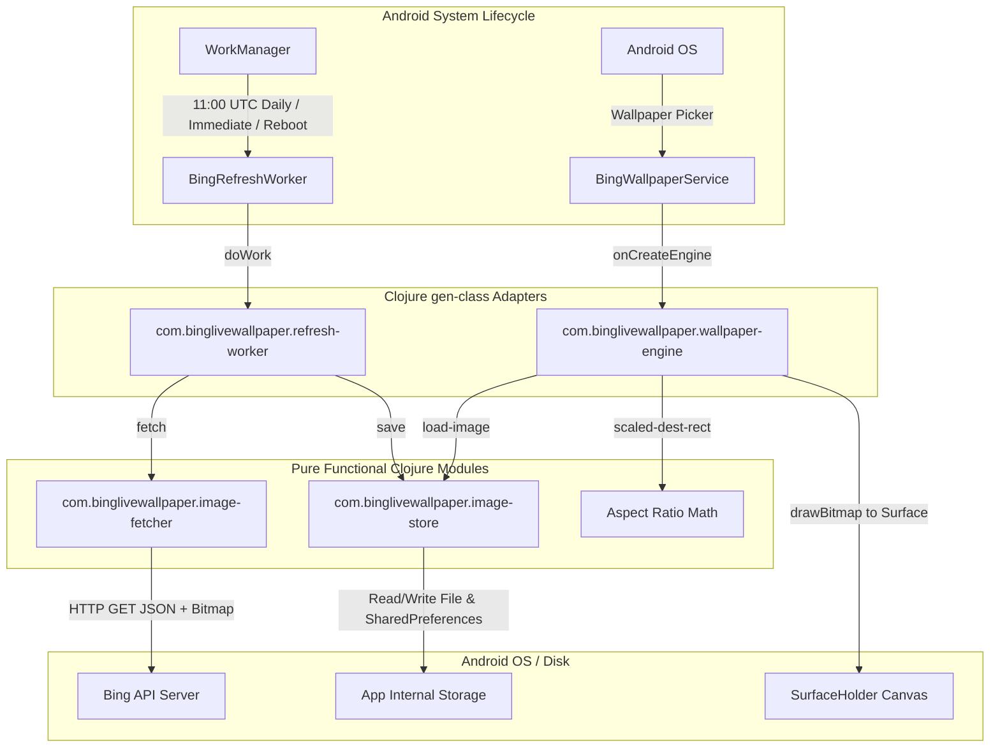

# Learning Clojure through Bing Live Wallpaper: A Comprehensive Guide

Welcome to Clojure! As an experienced programmer coming from imperative, object-oriented languages (like Java, Kotlin, Python, or C++), learning Clojure is not just about learning a new syntax—it is about adopting a **data-oriented, functional mindset** hosted seamlessly on the Java Virtual Machine.

This guide explains Clojure fundamentals, syntax, data structures, state management, and Java/Android interop directly using the code in this repository.

---

## 1. Project Architecture Overview

The app's architecture follows a functional design: **Pure functional logic at the core, with stateful Android framework lifecycle adapters at the boundary.**



---

## 2. Clojure Syntax & Core Constructs for Non-Lisp Programmers

In C-family languages, code is made of statements and expressions with infix operators (`a + b`, `obj.method(x)`).
In Clojure, **everything is an S-expression (Symbolic Expression)** enclosed in parentheses `(operator arg1 arg2 ...)` using **prefix notation**.

### 2.1 The Mental Model: Forms & Prefix Notation
| Concept | Java / Kotlin Syntax | Clojure Equivalent | Explanation |
| :--- | :--- | :--- | :--- |
| **Arithmetic** | `a + b * c` | `(+ a (* b c))` | `+` and `*` are functions called with arguments. |
| **Function Call** | `foo(x, y)` | `(foo x y)` | Space-separated arguments inside parentheses. |
| **Method Call** | `obj.method(x)` | `(.method obj x)` | Leading dot invokes an instance method. |
| **Field Access** | `obj.field` | `(.-field obj)` | `.-` accesses a public field. |
| **Constructor** | `new Rect(0, 0, w, h)` | `(Rect. 0 0 w h)` | Trailing dot invokes the constructor. |
| **Static Method** | `Math.max(a, b)` | `(Math/max a b)` | Slash separates ClassName and static member. |

---

## 3. Deep Dive into Source Files & Syntax

### 3.1 [`image_fetcher.clj`](file:///Users/mike/Code/bing-live-wallpaper/app/src/main/clojure/com/binglivewallpaper/image_fetcher.clj): Networking, Flow Control & Java Interop

#### 3.1.1 Namespace Declaration (`ns`)
```clojure
(ns com.binglivewallpaper.image-fetcher
  (:require [clojure.string :as str])
  (:import [android.graphics Bitmap Bitmap$CompressFormat BitmapFactory]
           [android.util Log]
           [java.io BufferedReader File FileOutputStream InputStream InputStreamReader]
           [java.net HttpURLConnection URL]
           [java.text SimpleDateFormat]
           [java.util Date Locale TimeZone]
           [org.json JSONObject]))
```
- `(:require ...)` imports other Clojure namespaces and aliases them (`str`).
- `(:import ...)` imports Java classes. Nested classes use `$` in Java bytecode (e.g. `Bitmap$CompressFormat`).

#### 3.1.2 Variable & Function Definitions (`def`, `defn`, `defn-`)
```clojure
(def ^:private tag "BingImageFetcher")
(def ^:private json-url "https://www.bing.com/HPImageArchive.aspx?format=js&uhd=1&idx=0&n=1&mkt=en-US")
```
- `def` binds a root variable (Var).
- `^:private` is metadata attaching `{:private true}` to make it namespace-private.
- `defn` defines a public function; `defn-` is a shortcut for a private function.

#### 3.1.3 Java Interop: `doto` and Type Hints
Look at [`get-today-utc-date-string`](file:///Users/mike/Code/bing-live-wallpaper/app/src/main/clojure/com/binglivewallpaper/image_fetcher.clj#L20-L24):
```clojure
(defn get-today-utc-date-string
  "Returns today's date formatted as YYYYMMDD in UTC."
  ^String []
  (let [sdf (doto (SimpleDateFormat. "yyyyMMdd" Locale/US)
              (.setTimeZone (TimeZone/getTimeZone "UTC")))]
    (.format sdf (Date.))))
```
- `^String`: Return type hint to avoid JVM reflection.
- `let [binding-name value ...]`: Scoped lexical bindings (immutable local variables).
- `doto`: Takes an object, evaluates expressions against it (inserting the object as the first argument to each), and **returns the object itself**. Equivalent to:
  ```java
  SimpleDateFormat sdf = new SimpleDateFormat("yyyyMMdd", Locale.US);
  sdf.setTimeZone(TimeZone.getTimeZone("UTC"));
  return sdf.format(new Date());
  ```

#### 3.1.4 Resource Management with `with-open` and Loops with `loop`/`recur`
Look at [`http-get`](file:///Users/mike/Code/bing-live-wallpaper/app/src/main/clojure/com/binglivewallpaper/image_fetcher.clj#L37-L55):
```clojure
(with-open [reader (BufferedReader. (InputStreamReader. (.getInputStream conn)))]
  (let [sb (StringBuilder.)]
    (loop [line (.readLine reader)]
      (when line
        (.append sb line)
        (.append sb "\n")
        (recur (.readLine reader))))
    (.toString sb)))
```
- `with-open`: Clojure's equivalent of Java's `try-with-resources` / Kotlin's `use`. Automatically calls `.close()` on exit (even on exceptions).
- `loop` / `recur`: Clojure has no `while` or `for` loops with mutation. Instead, recursion via `recur` provides tail-call-optimized (TCO) looping without blowing the stack.
  - `loop [line (.readLine reader)]` defines loop target with initial parameter `line`.
  - `(recur (.readLine reader))` re-executes the loop with a newly evaluated `line`.

---

### 3.2 [`image_store.clj`](file:///Users/mike/Code/bing-live-wallpaper/app/src/main/clojure/com/binglivewallpaper/image_store.clj): Mutating Java Fields & Chaining (`..`)

#### 3.2.1 Method Chaining with the Member Access Macro (`..`)
Look at [`save`](file:///Users/mike/Code/bing-live-wallpaper/app/src/main/clojure/com/binglivewallpaper/image_store.clj#L16-L25):
```clojure
(let [prefs (.getSharedPreferences context prefs-name Context/MODE_PRIVATE)]
  (.. prefs
      edit
      (putString key-url url)
      (putString key-date date-val)
      apply))
```
The `..` macro expands to nested method calls:
`(.apply (.putString (.putString (.edit prefs) key-url url) key-date date-val))`
In Java/Kotlin: `prefs.edit().putString(key-url, url).putString(key-date, date-val).apply()`.

#### 3.2.2 Accessing and Mutating Java Fields (`.-field` and `set!`)
Look at [`load-image`](file:///Users/mike/Code/bing-live-wallpaper/app/src/main/clojure/com/binglivewallpaper/image_store.clj#L40-L58):
```clojure
(let [bounds-opts (BitmapFactory$Options.)]
  (set! (.-inJustDecodeBounds bounds-opts) true)
  (BitmapFactory/decodeFile path bounds-opts)
  (when (and (pos? (.-outWidth bounds-opts)) (pos? (.-outHeight bounds-opts)))
    (let [sample-size (calculate-in-sample-size bounds-opts req-width req-height)
          decode-opts (BitmapFactory$Options.)]
      (set! (.-inSampleSize decode-opts) (int sample-size))
      (BitmapFactory/decodeFile path decode-opts))))
```
- `(.-inJustDecodeBounds bounds-opts)`: Reads the public field `inJustDecodeBounds`.
- `(set! (.-inJustDecodeBounds bounds-opts) true)`: Mutates the public Java field on `bounds-opts`.

---

### 3.3 [`wallpaper_engine.clj`](file:///Users/mike/Code/bing-live-wallpaper/app/src/main/clojure/com/binglivewallpaper/wallpaper_engine.clj): Android Lifecycle & State with Atoms

#### 3.3.1 Defining Android Framework Classes (`:gen-class`)
Android components (`WallpaperService$Engine`, `Worker`, `BroadcastReceiver`) must be real Java classes known to the Android manifest and classloader.

Look at the header in [`wallpaper_engine.clj`](file:///Users/mike/Code/bing-live-wallpaper/app/src/main/clojure/com/binglivewallpaper/wallpaper_engine.clj#L8-L15):
```clojure
(ns com.binglivewallpaper.wallpaper-engine
  (:gen-class
   :name com.binglivewallpaper.BingEngine
   :extends android.service.wallpaper.WallpaperService$Engine
   :constructors {[android.service.wallpaper.WallpaperService] 
                  [android.service.wallpaper.WallpaperService]}
   :init init
   :state state
   :prefix "engine-"))
```

| `:gen-class` Clause | Meaning |
| :--- | :--- |
| `:name` | Fully qualified Java class name generated into `.class` bytecode. |
| `:extends` | Superclass (`WallpaperService$Engine`). |
| `:constructors` | Mapping of `{ [ConstructorParamTypes] [SuperConstructorParamTypes] }`. |
| `:init` | Function name called when the object is instantiated (`engine-init`). |
| `:state` | Generates a `public final Object state` field on the Java class to hold Clojure state. |
| `:prefix` | Prefix string for function implementations matching class methods (`engine-`). |

#### 3.3.2 Managing Lifecycle State with Atoms (`atom`, `swap!`, `@`)
Look at [`engine-init`](file:///Users/mike/Code/bing-live-wallpaper/app/src/main/clojure/com/binglivewallpaper/wallpaper_engine.clj#L19-L24):
```clojure
(defn engine-init
  [^WallpaperService service]
  [[service]
   (atom {:service service
          :bitmap nil
          :paint (Paint. (bit-or Paint/ANTI_ALIAS_FLAG Paint/FILTER_BITMAP_FLAG))})])
```
1. `engine-init` returns a 2-element vector: `[[super-args...] initial-state]`.
2. `initial-state` is an **Atom** holding a map `{:service ..., :bitmap ..., :paint ...}`.

**How Atoms Work:**
- **Dereferencing (`@` or `deref`)**:
  In [`draw-wallpaper`](file:///Users/mike/Code/bing-live-wallpaper/app/src/main/clojure/com/binglivewallpaper/wallpaper_engine.clj#L46):
  ```clojure
  (let [{:keys [bitmap paint]} @(.state this)]
    (if bitmap
      ...))
  ```
  `@(.state this)` atomically reads the current snapshot of the map.
  `{:keys [bitmap paint]}` is **map destructuring** (extracts keys `:bitmap` and `:paint` into local variables).
- **Atomic State Updates (`swap!`)**:
  In [`engine-onSurfaceCreated`](file:///Users/mike/Code/bing-live-wallpaper/app/src/main/clojure/com/binglivewallpaper/wallpaper_engine.clj#L63):
  ```clojure
  (swap! (.state this) assoc :bitmap loaded)
  ```
  `swap!` applies `(assoc current-map :bitmap loaded)` atomically using Compare-And-Swap (CAS). No mutex locks needed!

---

### 3.4 [`refresh_worker.clj`](file:///Users/mike/Code/bing-live-wallpaper/app/src/main/clojure/com/binglivewallpaper/refresh_worker.clj): WorkManager Worker & Static Methods

Look at [`refresh_worker.clj`](file:///Users/mike/Code/bing-live-wallpaper/app/src/main/clojure/com/binglivewallpaper/refresh_worker.clj#L16-L26):
```clojure
(ns com.binglivewallpaper.refresh-worker
  (:gen-class
   :name com.binglivewallpaper.BingRefreshWorker
   :extends androidx.work.Worker
   :constructors {[android.content.Context androidx.work.WorkerParameters]
                  [android.content.Context androidx.work.WorkerParameters]}
   :init init
   :state state
   :prefix "worker-"
   :methods [^:static [schedule [android.content.Context] void]
             ^:static [runOnceNow [android.content.Context] void]
             ^:static [initialDelayToNextUtc [int] long]]))
```
- `:methods`: Declares additional Java methods on the generated class. `^:static` creates `public static void schedule(Context context)` accessible from Java/Kotlin or Android framework.
- `worker-doWork`: Implements `public Result doWork()` from `androidx.work.Worker`.

---

## 4. Clojure Data Structures vs. Java Data Structures

### 4.1 Clojure Persistent Data Structures
Clojure collections are **immutable and persistent**. When you "modify" a collection, you get a new collection while sharing internal nodes (structural sharing) in $O(\log_{32} N)$ time (effectively $O(1)$).

```
Clojure Value Types:
  nil           -> Java null
  true / false  -> Boolean
  42 / 3.14     -> Long / Double
  "hello"       -> java.lang.String
  :date         -> clojure.lang.Keyword (interned identifier, fast lookup)
  'foo          -> clojure.lang.Symbol (refers to a var or binding)

Clojure Collections:
  Vectors:  [1 2 3]              -> Indexed array-like, fast append/lookup (get v 0, nth v 0, conj v 4)
  Maps:     {:a 1 :b 2}          -> Hash map, key-value lookup ((:a m), (get m :a), (assoc m :c 3))
  Lists:    '(1 2 3)             -> Singly linked list, used for code & LIFO (first, rest, cons)
  Sets:     #{:cat :dog}         -> Unique items ((:cat s), (contains? s :cat))
```

### 4.2 Contrast with Java / Android Objects
| Feature | Clojure Data Structures | Java / Android Objects |
| :--- | :--- | :--- |
| **Mutability** | 100% Immutable | Mutable by default |
| **Equality** | Deep value equality (`(= {:a 1} {:a 1})` is `true`) | Reference identity (`==` / `.equals()`) |
| **Thread Safety** | Thread-safe by definition (no locking needed) | Requires synchronization / volatile / atomics |
| **API Style** | Functions (`assoc`, `dissoc`, `get`, `update`, `map`, `filter`) | Object methods (`obj.put()`, `obj.get()`) |

---

## 5. Summary Cheat Sheet for Reading Clojure Code

```clojure
;; 1. Local Variables
(let [a 10
      b 20]
  (+ a b))              ;; => 30

;; 2. Conditionals
(if (> a 5)
  "greater"             ;; then
  "smaller")            ;; else

(when (pos? a)          ;; when true, execute multiple statements
  (println "positive")
  a)

;; 3. Collections
(def my-map {:url "https://bing.com" :date "20260828"})
(:url my-map)           ;; Keyword as function => "https://bing.com"
(assoc my-map :size 100);; Returns NEW map with :size

;; 4. Java Interop
(String. "hello")       ;; Constructor: new String("hello")
(.toUpperCase "hello")  ;; Instance method: "hello".toUpperCase()
(Math/max 10 20)        ;; Static method: Math.max(10, 20)
(.-outWidth opts)       ;; Field access: opts.outWidth
(set! (.-outWidth opts) 100) ;; Field mutation: opts.outWidth = 100

;; 5. Threading Macros (Pipelining)
;; (-> x f g) is equivalent to (g (f x))
(-> "  hello world  "
    (.trim)
    (.toUpperCase))     ;; => "HELLO WORLD"
```
